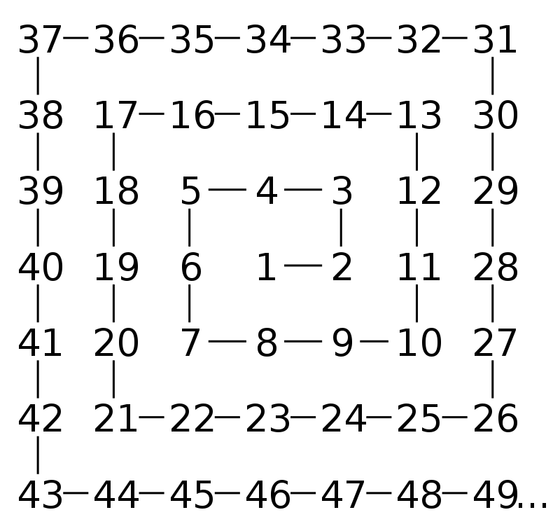
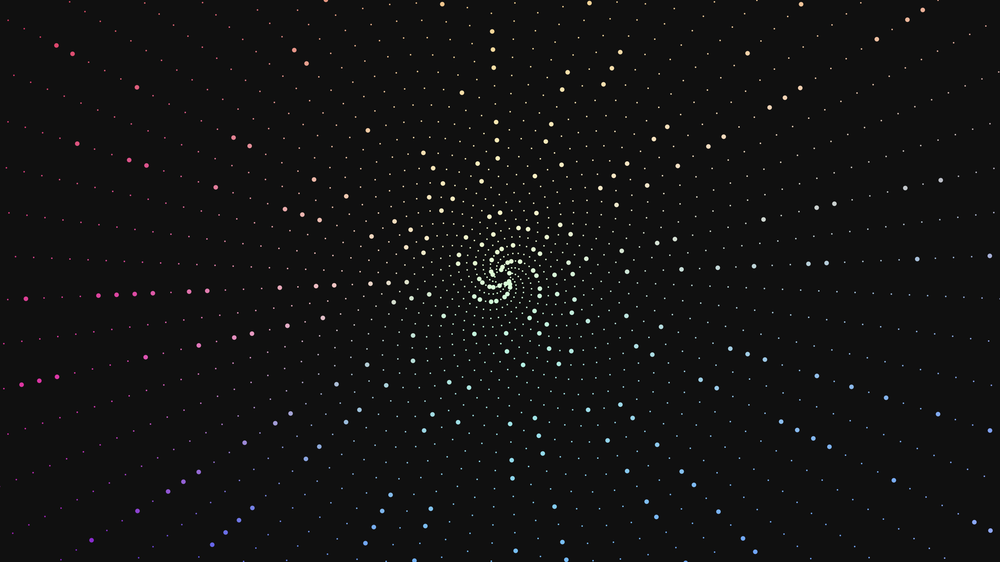
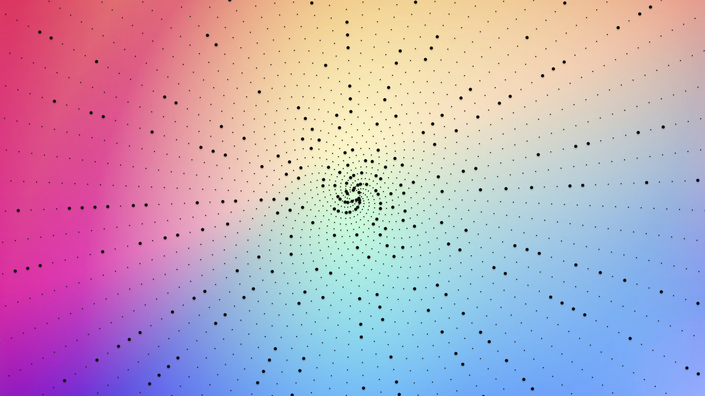

# Ulam's Spiral Wallpaper

---

## Introduction
This code uses the **Turtle** graphics module in **Python** to create a visualization of the [Ulam Spiral](https://en.wikipedia.org/wiki/Ulam_spiral), which is a spiral pattern of numbers that reveals patterns in the distribution of prime numbers.

>The **Ulam spiral** or **prime spiral** is a graphical depiction of the set of [prime numbers](https://en.wikipedia.org/wiki/Prime_number "Prime number"), devised by mathematician Stanisław Ulam in 1963 and popularized in Martin Gardner's Mathematical Games column in _Scientific American_ a short time later. It is constructed by writing the positive integers in a square spiral and specially marking the prime numbers.
Ulam and Gardner emphasized the striking appearance in the spiral of prominent diagonal, horizontal, and vertical lines containing large numbers of primes. Both Ulam and Gardner noted that the existence of such prominent lines is not unexpected, as lines in the spiral correspond to quadratic polynomials, and certain such polynomials, such as Euler's **prime-generating polynomial**, $$x^2 − x + 41$$ are believed to produce a high density of prime numbers. Nevertheless, the Ulam spiral is connected with major unsolved problems in number theory such as Landau's problems. In particular, no quadratic polynomial has ever been proved to generate infinitely many primes, much less to have a high asymptotic density of them, although there is a well-supported conjecture as to what that asymptotic density should be.

  

## Code

The code ([UlamSpiral.py](UlamSpiral.py)) starts by setting up the Turtle window with a black background, hiding the turtle cursor, and turning off animation updates. It then sets the size of each dot and initializes the turtle position at the center of the screen.

The code then loops from 1 to 3000 (just an arbitrary number) and checks whether each number is prime or not using a basic prime number testing algorithm that divides the number by every integer from 2 to half the number. If the number is prime, a white dot is drawn at the current turtle position, otherwise a smaller white dot is drawn.

After each dot is drawn, the turtle moves forward by a distance that increases with each iteration, creating the spiral pattern. The turtle also turns to the left by a fixed angle (35 degrees in this case) after each dot is drawn to create the spiral pattern.

Finally, the canvas is saved as a postscript file called "Ulam.ps" and the Turtle window is closed.

The `.ps` file is then converted to an image type file, such as `.png`, and after some editing using Adobe Photoshop CC 2020, here is a beautifully rendered Ulam spiral.

## Outputs

    

    

